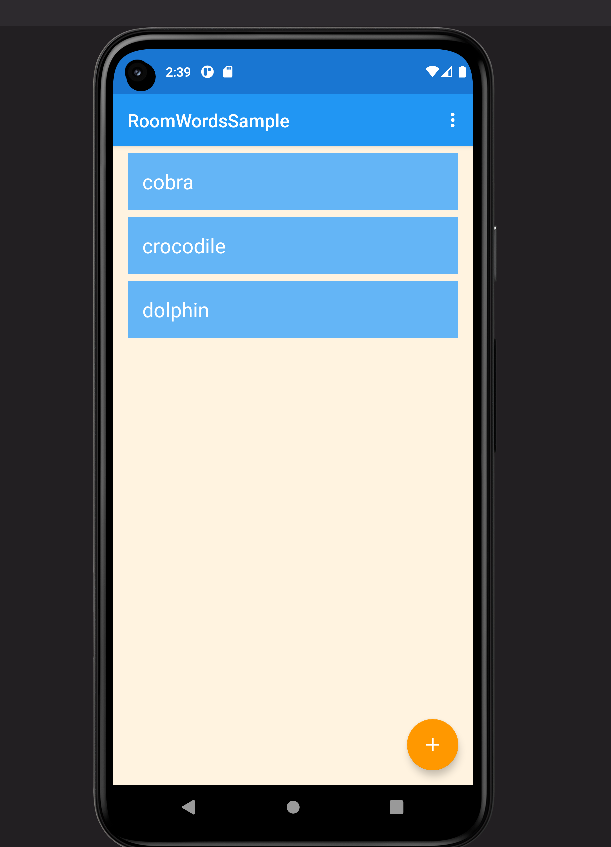
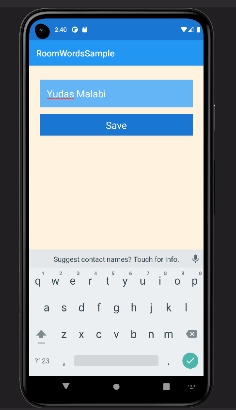
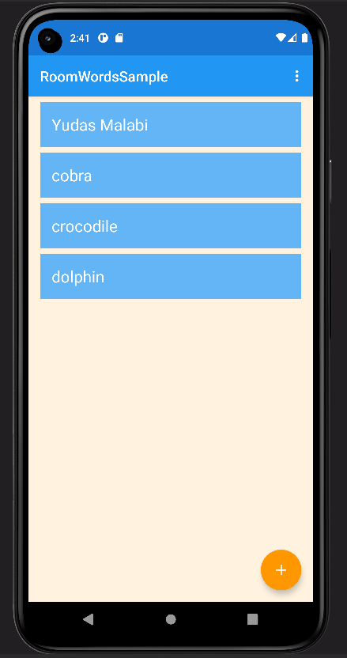

# Tugas Praktikum Room

https://developer.android.com/codelabs/android-training-livedata-viewmodel#0

Silakan diselesaikan codelab tsb dan push ke github dengan nama repository: android-room

Link github disubmit ke LMS

Nama : Yudas Malabi

Kelas : TI 3C / 25

NIM : 2041720054

## Screenshot Hasil Praktikum

- Main Activity 

- NewWord Activity

- Hasil ketika berhasil tambah data

